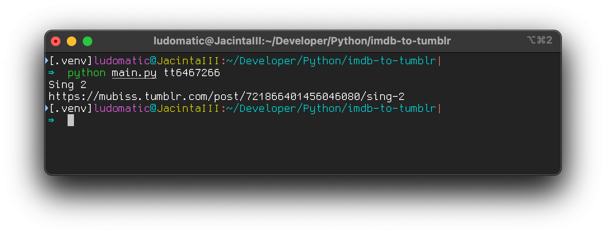

# iMDb to Tumblr

## Table of Contents

- [iMDb to Tumblr](#imdb-to-tumblr)
  - [Table of Contents](#table-of-contents)
  - [About ](#about-)
  - [Getting Started ](#getting-started-)
    - [Prerequisites](#prerequisites)
    - [Installing](#installing)
  - [Usage ](#usage-)
  - [Why? ¯\\\_(ツ)\_/¯](#why-_ツ_)

## About <a name = "about"></a>

Publish in your tumblr blog the poster of the movie that you want.

## Getting Started <a name = "getting_started"></a>

### Prerequisites

This script needs the API of Tumblr and TMDB.

+ Who to get those APIs
  + TMBD: [Create an account](https://www.themoviedb.org/signup) and follow this [easy steps](https://developer.themoviedb.org/docs/getting-started).
  +  Tumblr: [Follow this steps](https://github.com/tumblr/pytumblr#using-the-interactive-console). `interactive_console.py` will create a `.tumblr` file in your root path.

### Installing

Clone this repo and install it wherever you want.

`
git clone https://github.com/lud0matic/imdb-to-tumblr.git
`

Rename `.env.exam` to `.env`

Copy every API KEY that you get from the [Prerequisites](#prerequisites) and paste it in `.env` file. In `BLOG_NAME=` write the name of your blog <ins>without</ins> `tumblr.com`.

If you use `poetry`, run.

``` shell
poetry install
```

Otherwise, use `pip`.

```shell
pip install -r requirements.txt
```

`Poetry` doesn't load `.env` variables by default. I installed [this plugin](https://github.com/volopivoshenko/poetry-plugin-dotenv) to solve this.

If you end up using `pip`, install `python-dotenv`

```shell
pip install python-dotenv
```

And uncomment this two lines in main.py file.

``` python
from dotenv import load_dotenv
load_dotenv()
```

## Usage <a name = "usage"></a>

Find in [imdb.com](https://imdb.com) the movie poster that you want to puslish and copy the imdb id. In this case `tt6467226`.


Run the script including the id. You will get the movie's name and the post url.



The title of the post will be the name of the movie, and the tags will include the original movie's name, its translation to english, the director's name and the current year. If you use the `-f` flag, the favorite tag will be included in the post. This helps to filter all the posts that you think deserve that category.


## Why? ¯\\\_(ツ)_/¯ 

Since 2011, I have been posting the poster of every movie I watched. It is one of the many things I love to keep track of. During the pandemic, I learned Python. Before that, every post I published [on my blog](https://mubiss.tumblr.com) was created manually. I would search for the poster, resize it, copy the movie's name and director, and then publish the post. At one point, I ended up hating this process. The main idea behind this script is to automate the entire process.